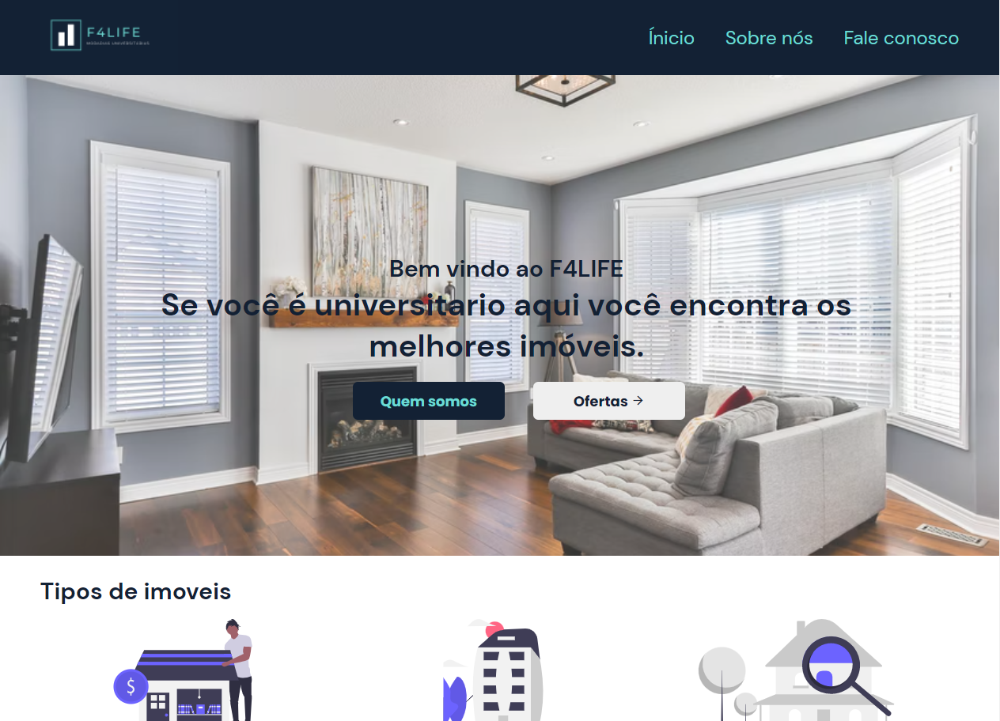

  

## Projeto

- Desafio proposto durante curso de formação do Desenvolve
- Desenvolvido para processo seletivo do Grupo Boticario.
- Feito apenas com base na logotipo e com algumas exigências.

## 🚀 Tecnologias

Esse projeto foi desenvolvido com as seguintes tecnologias:

- HTML
- CSS
- JavaScript

## 📚 O que aprendi:

- Reforcei minha base em HTML e CSS
- Aprendi mais sobre JavaScript
- Exercitei minha criatividade
- Lidar de maneira diversas com os problemas
